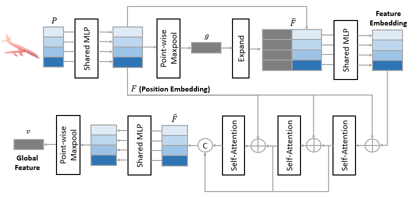
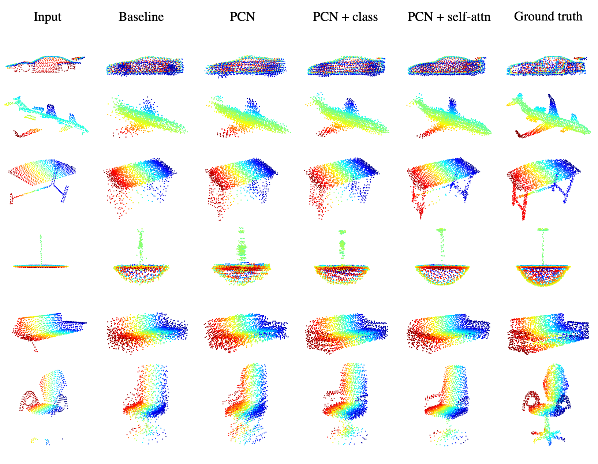

# pointcloud_completion

This repository contains the codes of our final project for EECS 598-012 in W21. Here is a [link](https://mingyuyng.github.io/data/EECS598_012_Final_Report.pdf) to our final report. It contains the implementation of PCN in PyTorch and an extension with self-attention layers and additinal classification loss. The self-attention layer is motivated by this [paper](https://link.springer.com/content/pdf/10.1007/s41095-021-0229-5.pdf). 

## Dataset
Please download the Complete3D dataset from [link](https://github.com/lynetcha/completion3d) and place it under the `dataset` folder. The dataloader is borrowed from the [github](https://github.com/hzxie/GRNet) of GRNet. 

## Build PyTorch extensions for Chamfer distance
    cd $./models/extensions/chamfer_dist
    python setup.py install --user
The implementation of Chamfer distance is from the [github](https://github.com/hzxie/GRNet) of GRNet.

## Update the paths in the configuration file (config.py)
    __C.DATASETS.COMPLETION3D.CATEGORY_FILE_PATH     = '/home/mingyuy/pointcloud_completion/dataset/Completion3D.json'
    __C.DATASETS.COMPLETION3D.PARTIAL_POINTS_PATH    = '/home/mingyuy/pointcloud_completion/dataset/shapenet/%s/partial/%s/%s.h5'
    __C.DATASETS.COMPLETION3D.COMPLETE_POINTS_PATH   = '/home/mingyuy/pointcloud_completion/dataset/shapenet/%s/gt/%s/%s.h5'

## Example point clouds and performance

|           | Average | Airplane | Cabinet | Car  | Chair | Lamp  | Sofa  | Table | Watercraft |
|---------  |---------|----------|---------|------|-------|-------|-------|-------|------------|
| PointFCAE | 17.52   | 5.71     | 20.18   | 8.23 | 20.22 | 30.60 | 15.15 | 26.54 | 13.53      |
| PCN       | 16.64   | 5.13     | 21.02   | 8.15 | 19.68 | 26.33 | 14.28 | 26.51 | 12.05      |
| PCN_cla   | 15.29   | 4.30     | 19.10   | 7.48 | 17.78 | 24.97 | 13.47 | 24.16 | 11.09      |
| PCN_trans | 13.65   | 3.68     | 18.77   | 7.10 | 16.65 | 19.50 | 12.34 | 22.03 | 9.12       |
